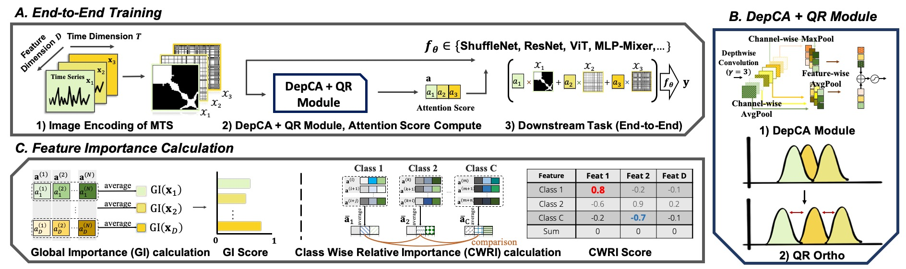
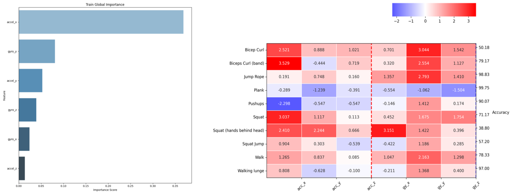

# CAFO [](https://shields.io/)
[KDD 2024] CAFO: Feature-Centric Explanation on Time Series Classification



This is the official implementation of our paper ["CAFO: Feature-Centric Explanation on Time Series Classification", KDD 2024](https://arxiv.org/abs/2406.01833v2) by **Jaeho Kim**, Seok-Ju (Adam) Hahn, Yoontae Hwang, Junghye Lee, and Seulki Lee. 

## Introduction
CAFO (Channel Attention and Feature Orthogonalization) is a novel framework for feature-centric explanation in multivariate time series (MTS) classification. We provide the official implementation for CAFO.


## Contents
- `channelattention`: Contains the `depthwise` channel attention module, along other channel attention modules used in our paper.
- `conf`: Configuration files based on `hydra` library. 
- `dataset`: PyTorch datasets.
- `featureorderstudy`: Constructs feature ranks, summarize rank results based on run files.
- `importance_visualizer`: Scripts for visualizing feature importance (CWRI, GI).
- `lightning_models`: `PyTorch Lightning` based trainers.
- `loss`: The QR Regularizer loss
- `model`: The model architectures used for CAFO.
- `scripts`: Utility scripts for running experiments, preprocessing, etc.
- `notebook`: Contains all the visualization files needed to reproduce our work.

## Installation
CAFO was tested on the below dependency. You can simply run the following command. CAFO was tested on two `CUDA 11.6` and `CUDA 10.1`
```sh
conda create --name CAFO python=3.8.16
conda activate CAFO
pip install -r requirements.txt
```

The main dependency are the following. Others can be adjusted (maybe?)
```sh
torch==1.13.1
pytorch-lightning==1.6.5 #Trainer module
pyts==0.12.0 # for RP, GAF encoding
hydra-core==1.2.0
hydra-colorlog==1.2.0
setuptools==59.5.0
```


## Data
We provide the Github links for each dataset used. 
You can access all the datasets in our google drive [link](https://drive.google.com/drive/folders/16Xks-9O6BeTFHOba9-HZRZcnd2GnrUVg?usp=sharing) except for Gilon task. 

### Gilon.
This dataset is accessbile only for research purpose based on the agreement made with the `Gilon` corporation. Please submit the Google Form in the Gilon [Repo](https://github.com/Gilon-Inc/GILON-MULTITASK-DATASET) to get access.

### MS_HAR.
We provide the preprocessing code for this dataset in the MS [Repo](https://github.com/jaeho3690/Microsoft_HAR_dataset_processing_code).

### WhichFinger.
Please kindly refer to our [WhichFinger](https://github.com/jaeho3690/WhichFinger-MTS-Dataset) Github Repository.

### SquidGame.
For model training, use the data from the Google Drive.
We also provide the codes that were used to generate the data.
```sh
python make_squidgame/generate_data.py
```


## How to Run?
We provide an example of running the `MS HAR` Task. Download and place the MS HAR data into `data/microsoft_chunk200_window200_subset10` directory.

There are two main functions `main_cafo` and `main_ce`. `main_cafo` is the main function to run CAFO module with QR decomposition based loss. The main module runs the `lightning_model_cls_cafo_qr.py` trainer. The below is an example of running the `microsoft_activity` task, with `shufflenet` model. You can set which validation fold to use with `task.validation_cv_num`. `gamma` controls the regularization parameter.


### Commands for main_cafo.py
``` sh
python  main_cafo.py task=microsoft_activity model=shufflenet \
        task.validation_cv_num=0 \
        gpu_id=1 lightning_model=lightning_model_cls_cafo_qr exp_num=9999 \
        channelattention.expansion_filter_num=3 loss.gamma=0.5 loss=qrregularizer \
        dataset.batch_size=512 add_random_channel_idx=false seed=42 
```

Running the above commands will output `outputs/microsoft_activity/global_attention/9999_cv0_global_attention.png` and `outputs/microsoft_activity/classwise_attention/9999_cv0_classwise_attention.png` like the below.


### Commands for main_ce.py
``` sh
python main_ce.py task=microsoft_activity model=shufflenet task.validation_cv_num=0\
            gpu_id=1 lightning_model=lightning_model_cls_cafo_ce exp_num=9998 \
            channelattention=depthwise channelattention.expansion_filter_num=3\
            dataset.batch_size=512 add_random_channel_idx=false seed=42
```

Executing the commands specified above will save the output files to the `outputs/data_name/exp_ num/` directory. In this path, `exp_num` represents a directory number that you can assign to each of your experiments for organization purposes.
